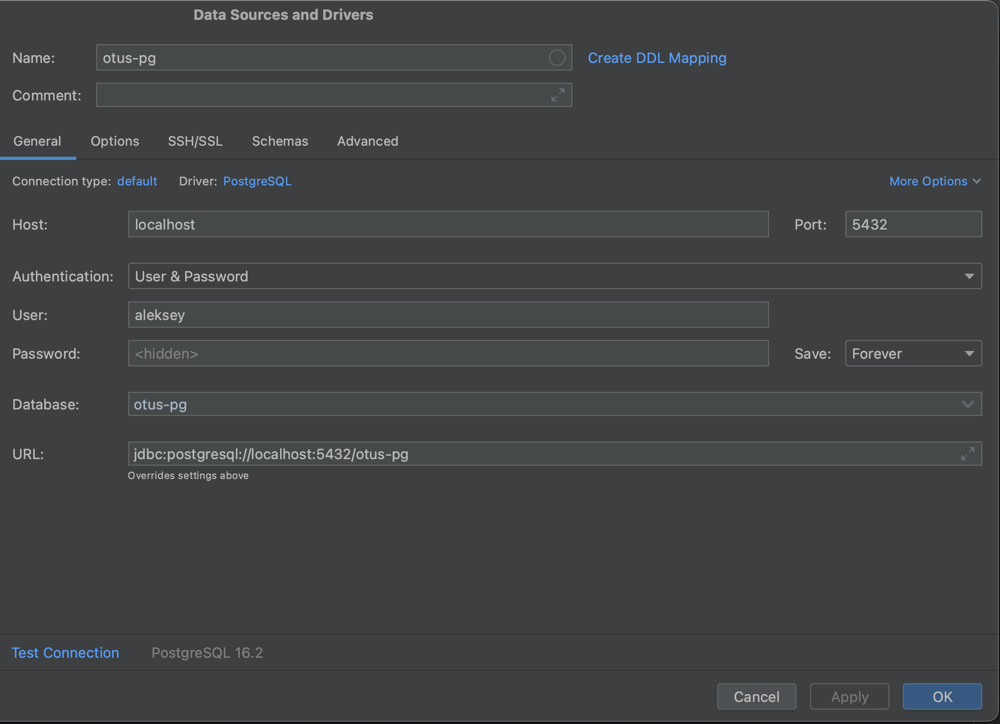
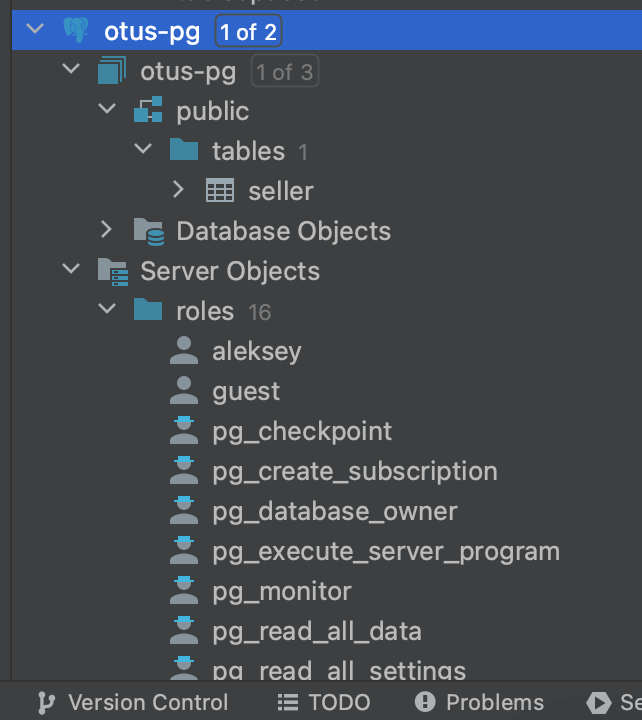

# Внутренняя архитектура СУБД PostgreSQL 

## Настройка контейнера и запуск PostgreSQL
Базу данных будем разворачивать внутри Docker-контейнера. Для удобства запуска контейнера с базой будем использовать *docker-compose*.\
Создаем YAML-файл:
```
version: '3.9'
volumes:
  pg_project:
services:
  pg_db:
    image: postgres:16.2
    restart: unless-stopped
    environment:
      POSTGRES_DB: "otus-pg"
      POSTGRES_USER: "aleksey"
      POSTGRES_PASSWORD: "1234"
      PGDATA: "/var/lib/postgresql/data/pgdata"
    volumes:
      - .:/var/lib/postgresql/data
    ports:
      - "5432:5432"
    healthcheck:
      test: ["CMD-SHELL", "pg_isready -U twpguser -d twdb"]
      interval: 15s
      timeout: 10s
      retries: 7
      start_period: 12s
    deploy:
      resources:
        limits:
          cpus: '1'
          memory: 4GB
```

Используем образ `postgres:16.2`\
База данных: `otus-pg`\
Открываем наружу порт *5432*, сервер будет доступен по *127.0.0.1:5432*

Чтобы после удаления контейнера данные нашей БД не удалялись, мы будем хранить их локально на диске. Для этого переопределим переменную окружение **PGDATA**: *"/var/lib/postgresql/data/pgdata"*.
После запуска контейнера рядом с compose-файлом будет создана директория *pgdata*, в которой будут храниться файлы БД

## Подключение к PostgreSQL

К базе можно подключиться либо CLI запущенного контейнера, либо снаружи через localhost.\
Будем подключаться снаружи (порт можно не указывать, так как он равен дефолтному) с помощью утилиты **psql**:
`psql -h 127.0.0.1 -U aleksey -d otus-pg`

## Подключение к серверу через IDE

В качестве IDE будем использовать **DataGrip**.



